# Landings

Коллекция лендингов разной тематики — примеры моей работы.

## Стек

HTML5, CSS3, vanilla JavaScript. Без фреймворков и сборщиков — каждый лендинг полностью самодостаточен.

## Живые демо

Все сайты опубликованы через GitHub Pages. Под каждым проектом виден первый экран лендинга, кнопка «Показать полный скриншот» разворачивает картинку целиком.

### ApexFinance Group — финансовые услуги
[🔗 Открыть демо](https://rimigon.github.io/Landings/apex-finance-group/) · [исходники](./apex-finance-group)

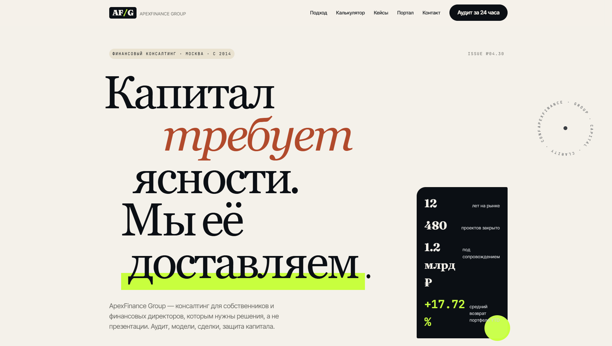

  
Показать полный скриншот

   
  

---

### ArtisanBakery Co — пекарня
[🔗 Открыть демо](https://rimigon.github.io/Landings/artisan-bakery-co/) · [исходники](./artisan-bakery-co)

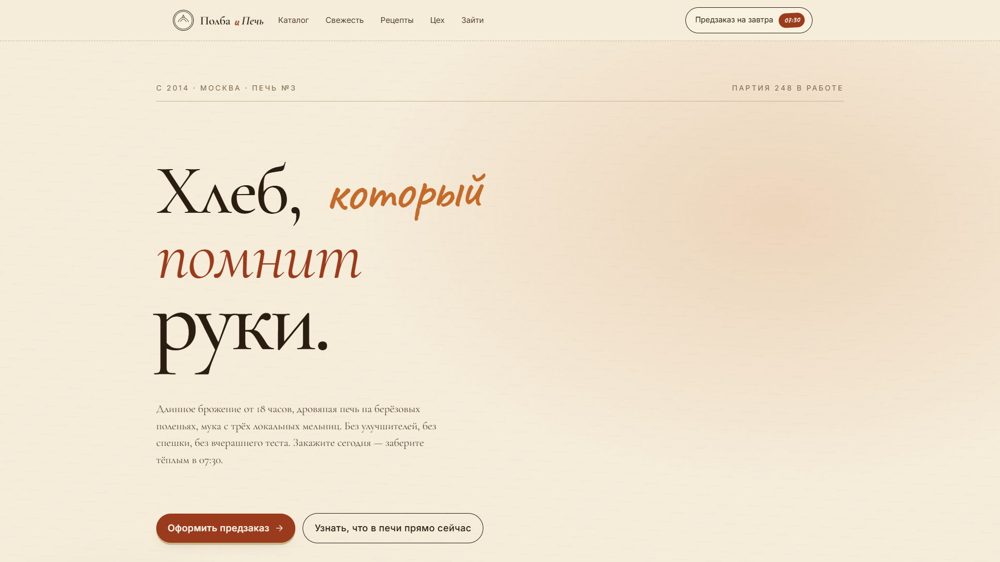

  
Показать полный скриншот

   
  

---

### ClearView Optics — оптика
[🔗 Открыть демо](https://rimigon.github.io/Landings/clearview-optics/) · [исходники](./clearview-optics)

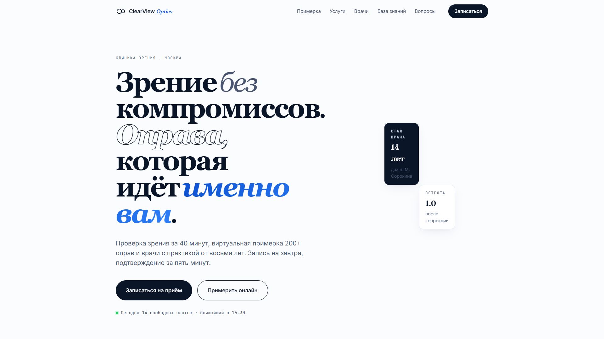

  
Показать полный скриншот

   
  

---

### DataVault Analytics — аналитика данных
[🔗 Открыть демо](https://rimigon.github.io/Landings/datavault-analytics/) · [исходники](./datavault-analytics)

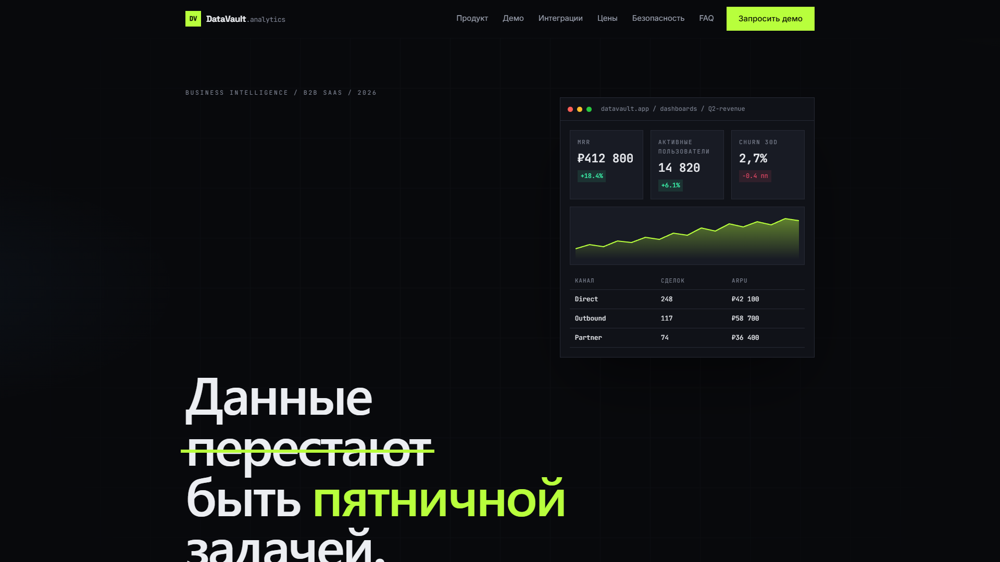

  
Показать полный скриншот

   
  

---

### LunaBeauty Clinic — клиника красоты
[🔗 Открыть демо](https://rimigon.github.io/Landings/lunabeauty-clinic/) · [исходники](./lunabeauty-clinic)

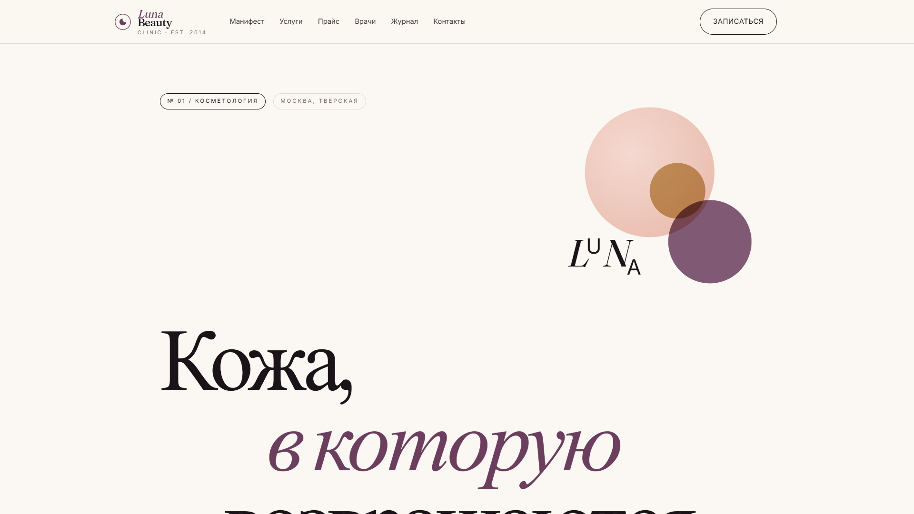

  
Показать полный скриншот

   
  

---

### LuxeAuto Rental — аренда премиум-авто
[🔗 Открыть демо](https://rimigon.github.io/Landings/luxeauto-rental/) · [исходники](./luxeauto-rental)

---

### NovaStay Hotels — отели
[🔗 Открыть демо](https://rimigon.github.io/Landings/novastay-hotels/) · [исходники](./novastay-hotels)

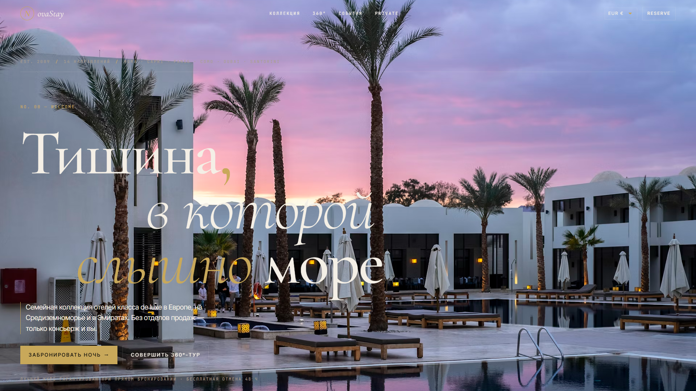

  
Показать полный скриншот

   
  

---

### PeakGear Outdoors — товары для туризма
[🔗 Открыть демо](https://rimigon.github.io/Landings/peakgear-outdoors/) · [исходники](./peakgear-outdoors)

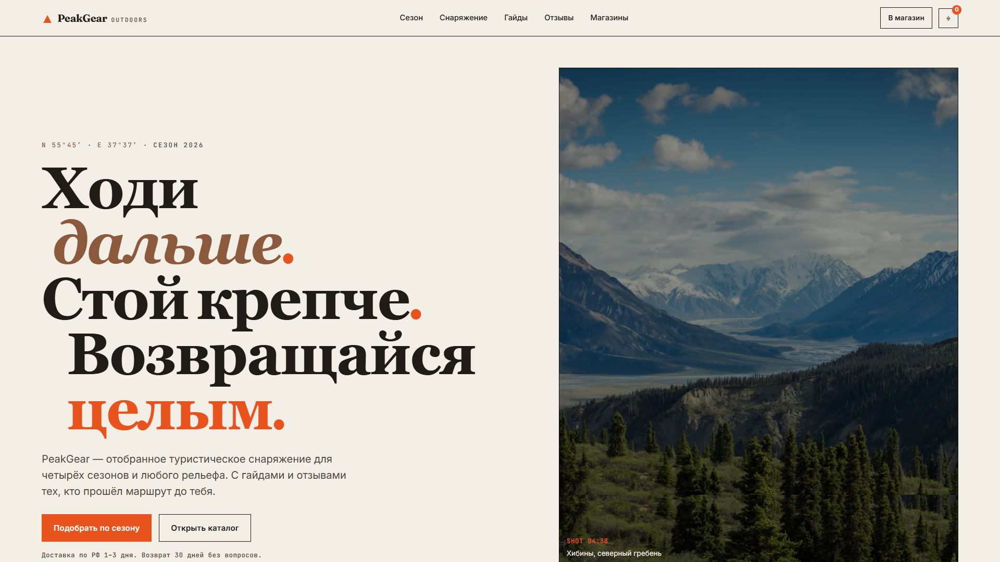

  
Показать полный скриншот

   
  

---

### QuickFix Repair — ремонтная мастерская
[🔗 Открыть демо](https://rimigon.github.io/Landings/quickfix-repair/) · [исходники](./quickfix-repair)

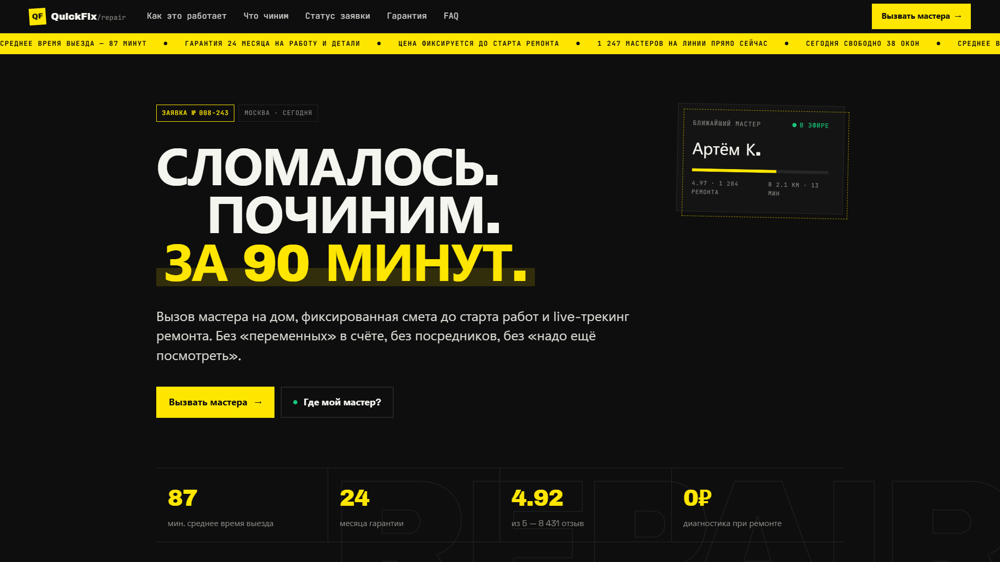

  
Показать полный скриншот

   
  

---

### TerraBuild Construction — строительная компания
[🔗 Открыть демо](https://rimigon.github.io/Landings/terrabuild-construction/) · [исходники](./terrabuild-construction)

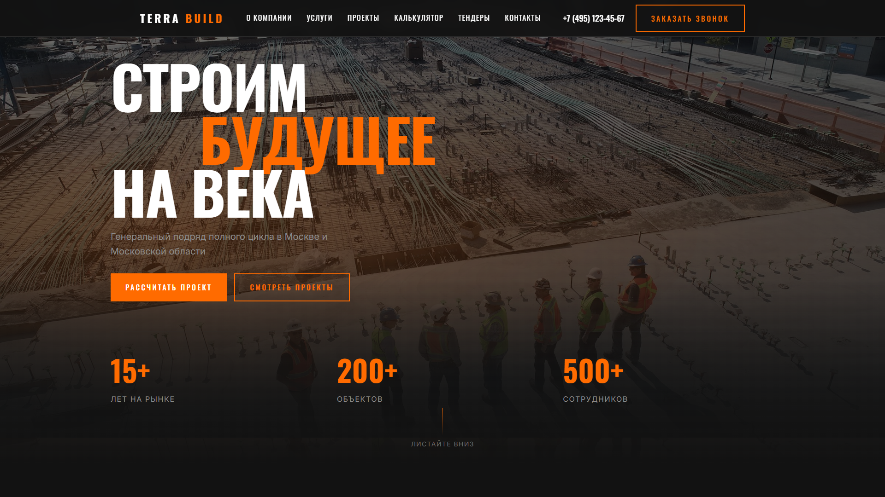

  
Показать полный скриншот

   
  

---

### UrbanBrew Coffee — сеть кофеен
[🔗 Открыть демо](https://rimigon.github.io/Landings/urbanbrew-coffee/) · [исходники](./urbanbrew-coffee)

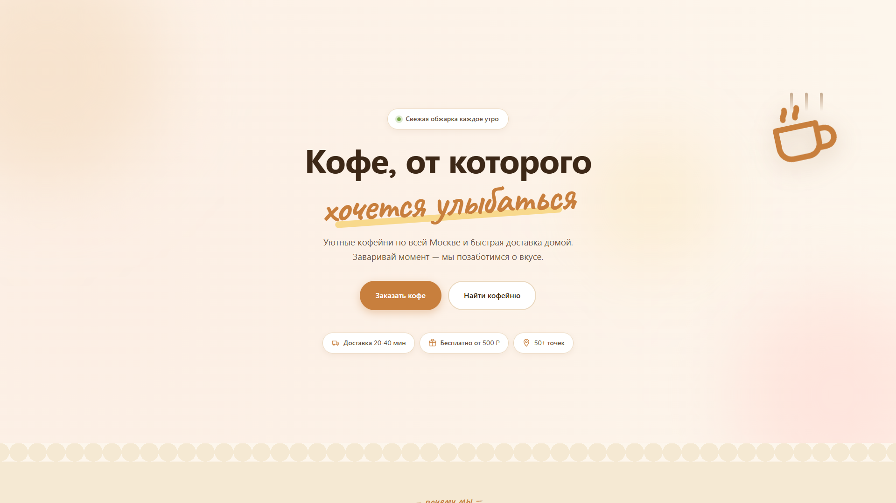

  
Показать полный скриншот

   
  

---

### VeloMotion Bikes — велосипеды
[🔗 Открыть демо](https://rimigon.github.io/Landings/velomotion-bikes/) · [исходники](./velomotion-bikes)

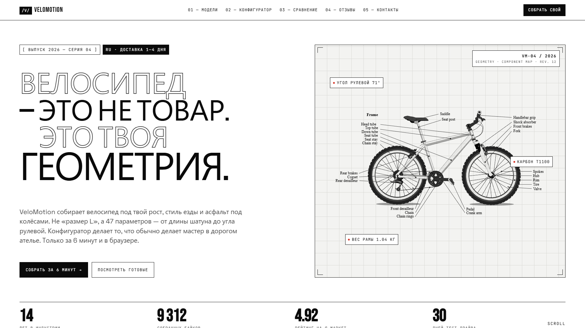

  
Показать полный скриншот

   
  

## Как это работает

Сайты хостятся бесплатно на GitHub Pages прямо из этого репозитория (ветка `main`, корневая папка). Каждый лендинг — отдельная папка со своим `index.html`.

## Контакты

Связаться можно через GitHub: [@Rimigon](https://github.com/Rimigon)
